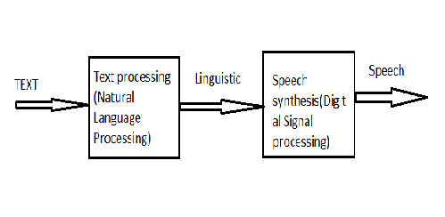
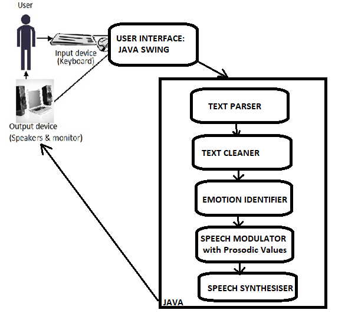
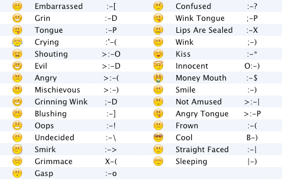
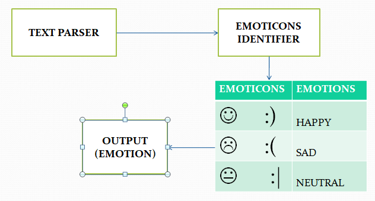
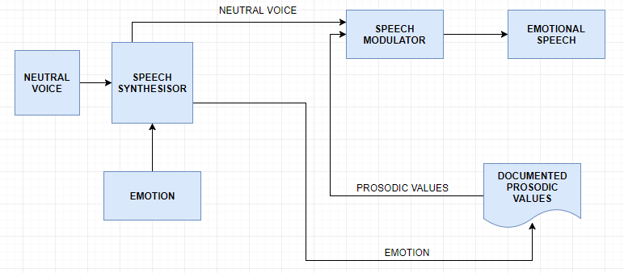
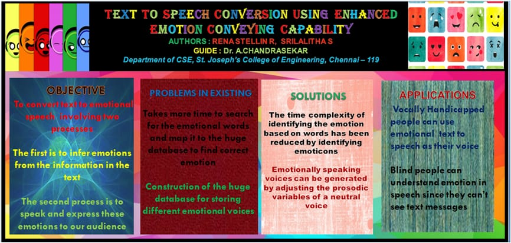

# Text To Emotional Speech Project

## Short Intro of how I started working on this project

During my final year in my Under graduation, I was so interested in making the computers and machines behave like humans. So as a starter I along with my friend started working on this project on December,2017 and finished the project on February,2018 (a period of 3 months roughly) with lots of fun and enjoyment. I had all the codes, documents and other files related to the project in my hard drive. Now I am uploading everything in Github to share with you all so that you guys can enjoy and have fun looking at my cool fun simple project.

## Abstract

During Expressive speech, the voice conveys intended
message as well as basic emotions of the speaker. This work focuses on the
development of expressive Text-to-Speech synthesis techniques. Text to
emotional speech conversions involves two processes. The first is to infer
emotions from the information in the text. For this there are many clues in the
word choice, word length, sentence length, and punctuation. The second process
is to speak and express these emotions to our audience. The first process of
finding emotions from the text is often time consuming because it mostly
involved finding emotions based on words used in the input text and hence
training with the huge data set in the existing machine learning algorithms. In
this paper the time complexity of identifying the emotion based on words has
been reduced by identifying emoticons. The second process of speaking with
emotion can be easily done by just adjusting the prosodic variables. Mainly
identified prosodic variables are pitch of the voice, phoneme duration, length of
sounds, loudness, or prominence and timbre (quality of sound). These prosodic
variables which are derived from emotional speech samples are compared with
the features derived from neutral speech.TTS synthesizer computes the values
of a set of prosodic variables, starting from the linguistic information contained
in the text that has to be synthesized. These computed values are adjusted to
produce the intended emotional speech. The new emotional prosodic modules
are still based on the “Classification And Regression Tree” (CART) theory. The
CART method provides the best emotional speech output if it is trained with a
large-coverage corpus.

## Objective
The main objective of the project is to make text to emotional speech conversions much more realistic. This could be done if we could capture emotion from not only text but also text faces (emojis or emotion icons) and converting the text into emotional speech using prosodic variables variation techniques. Other objectives are to reduce the space complexity of the existing model by avoiding construction of the separate database for storing different emotional voices and to reduce the time complexity of searching under which emotion the found emotional words appear in database instead reducing the search by finding the emoticons. 

## Existing System
The text-to-speech (TTS) synthesis is to convert an arbitrary input text into intelligible and natural sounding speech. TTS system includes mainly two parts: natural language processing and digital signal processing. The general block diagram of TTS system is shown in figure.

Natural language processing contains three steps. They are text analysis, phonetic analysis and prosodic analysis. The text analysis includes segmentation, text normalization, and part of speech (POS) tagger. Phonetic conversion is to assign phonetic transcription to each word. There are two approaches in phonetic conversion. They are rule based and dictionary based approaches. Rule based is applied for unknown words whereas dictionary based is used for known words. Prosodic analysis is to determine intonation, amplitude and duration modelling of speech. It describes speaker‘s emotion.
 
## Drawbacks of Existing Model

### Problems in speech synthesis

For English and most of the other languages the conversion is much more complicated. A very large set of different rules and their exceptions is needed to produce correct pronunciation and prosody for synthesized speech.

### Pronunciation

The second task is to find correct pronunciation for different contexts in the text. Some words, called homographs, cause the most difficult problems in TTS systems. Homographs are spelled the same way but they differ in meaning and usually in pronunciation (e.g. fair, lives). The word lives is for example pronounced differently in sentences "Three lives were lost" and "One lives to eat". Some words, e.g. present, has different pronunciations depending on the context. (I was present there when he received the present).The characters 'th' in „mother‟ and „think‟ is pronounced differently. Some sounds may also be either voiced or unvoiced in different context. For example, phoneme /s/ in word dogs is voiced, but unvoiced in word cats. Finding correct pronunciation for proper names, especially when they are borrowed from other languages, is usually one of the most difficult tasks for any TTS system. Unfortunately, it is clear that there is no way to build database of all proper names in the world.

### Robotic (non-human) 

The speech that was generated was robotic and non-human which lacked emotions.

## Proposed Model

### Emotion Identification

•	 Pitch features derived from emotional speech samples are compared with the features derived from neutral speech
•	 Producing more humanoid effect to the speech involves capturing of mood from not only text but also text faces (emojis).

### Enhancement of Emotional Speech using Prosodic Analysis

Analysis of a language based on its patterns of stress and intonation in different contexts. In systemic grammar, prosodic analysis is regarded as an essential foundation for the analysis of syntax and meaning. Prosody’s three most important parameters are energy, fundamental frequency and duration. We have planned to concentrate more on the time duration and energy. After identifying the emotions in the text, the text can be converted into emotional speech by varying the time duration and energy. For example, increasing the speed of speaking a little bit to convey a happy mood and slightly lowering the speed and energy of the sound to convey sad mood and increasing the energy and pitch to express the angry mood and so on.

### Algorithm Used

Emotional prosody is a theory that explains when an individual's voice tone in speech which is conveyed through changes in the prosodic values such as pitch, loudness, timbre and rate which is different from linguistic and semantic information. Studies shows that some emotions, such as fear, joy and anger, are portrayed at a higher frequency than emotions such as sadness.

•	Anger: While comparing to the neutral speech, anger is produced with a lower pitch, higher intensity, more energy (500 Hz) in the vocalization. Hot anger, is produced with a higher, more varied pitch, and even greater energy (2000 Hz).

•	Fear : Fear can be panic or anxiety. While comparing to neutral speech, fear have a higher pitch and a faster speech rate with more pauses.

•	Sadness: While comparing to neutral speech, sad emotions are produced with a higher pitch, less intensity but more vocal energy (2000 Hz), longer duration with more pauses, and a lower first formant.

These prosodic values are hashed to the limits of the speech synthesizer and are used to create the required emotions.

## Architecture Diagram 
 

As in figure, the proposed architecture consists of two main phases which are emotion identification and speech modulation. Apart from that it includes text parser and text cleaner to provide accurate output on different test cases.
 Java provides the base for the proposed architecture. Swing API is used for providing the user interface to capture the text that is to be synthesized. The input provided by the user is obtained as text format from the keyboard.  The question remains, however, how much of an emotion we can convey via text? This is especially interesting since facial expression and voice intonation convey over 70% of the intended feelings in spoken language. Such facial expressions are provided through the emoticons.
  

Figure - Characters for emoticon recognition

The given input is analyzed for emotions from the emoticons used. Here, we are demonstrating based on three basic emotions happiness, sadness and fear. Emotion identification is through the identification of their respective emoticons. Once the emotion is identified and the prosodic variables are changed accordingly to provide the required emotional speech.

## Emotion Identification

•	Pitch features derived from emotional speech samples are compared with the features derived from neutral speech

•	Producing more humanoid effect to the speech involves capturing of mood  from not only text but also text faces (emojis).

Figure - Emotion identification from emoticons
 
## Speech Synthesis

•	Analysis of a language based on its patterns of stress and intonation in different contexts
•	In systemic grammar, prosodic analysis is regarded as an essential foundation for the analysis of syntax and meaning
•	Prosody’s three most important parameters are energy, fundamental frequency and duration
•	We have planned to concentrate more on the time duration
•	After identifying the emotions in the text, the text can be converted into emotional speech by varying the time duration.

Figure - Speed of words uttered in happiness 
      
As in the above graph, it shows the frequency of words uttred per second. During happiness, more words are uttered per second and hence there is an increased frequency.

Figure - Speed of words uttered in sadness
     
As in the above graph, it shows the frequency of words uttered per second. During happiness, more words are uttered per second and hence there is an increased frequency
                                     

Figure - Speech synthesisor

## Initial look

Initially during the development of the project, the output looked something like given in the below link

https://drive.google.com/file/d/1brRhJbcIlz4a9ceLYhMTe6e1A6eP5TS4/view?usp=sharing

## Final look

Also see the video attached in the files section

## Poster

